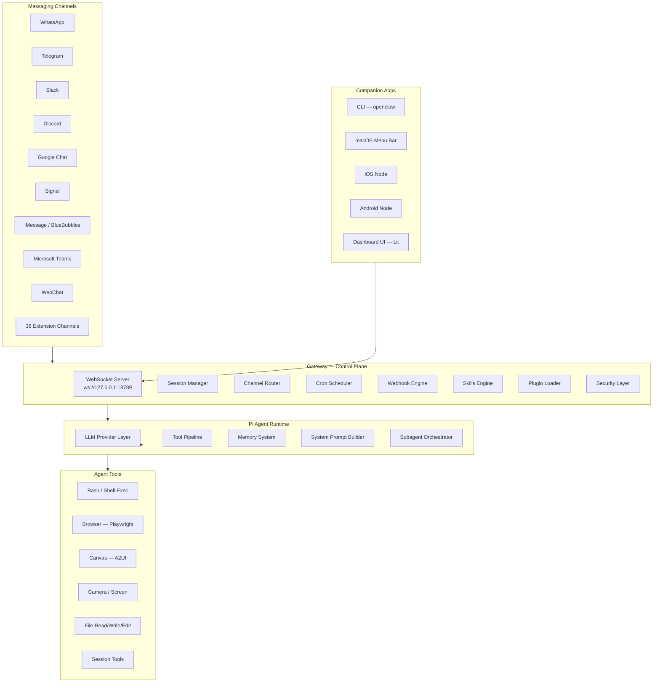

# AGDI / OpenClaw — Full Project Analysis

## What It Is

**OpenClaw** (rebranded as **AGDI** in this fork) is a **personal AI assistant** you run on your own devices. It's **not a chatbot framework** — it's the complete infrastructure to run an AI agent that reaches you across every messaging surface you already use.

> **One-liner:** A self-hosted, multi-channel AI gateway that turns any LLM into a personal assistant reachable on WhatsApp, Telegram, Slack, Discord, iMessage, Signal, Microsoft Teams, and more — with voice, vision, browser control, code execution, and native apps for macOS, iOS, and Android.

---

## Architecture Overview



---

## Tech Stack

| Layer | Technology |
|-------|-----------|
| **Language** | TypeScript (Node ≥22, ESM) |
| **Package Manager** | pnpm (10.23.0) |
| **Build** | tsdown (Rolldown-based), tsx for dev |
| **UI Framework** | Lit (Web Components) |
| **Test** | Vitest (unit, e2e, live, gateway, extensions) |
| **Lint** | oxlint + oxfmt |
| **Protocol** | WebSocket (ws) + Express HTTP |
| **macOS App** | Swift (SwiftUI) |
| **iOS App** | Swift (SwiftUI) |
| **Android App** | Kotlin (Jetpack Compose) |
| **Container** | Docker + Podman |
| **LLM Runtime** | `@mariozechner/pi-agent-core` (Pi agent) |
| **License** | MIT |

---

## Codebase Scale

| Metric | Count |
|--------|-------|
| Total `src/` files | ~2,990 |
| `src/agents/` files | 533 (largest subsystem) |
| `src/gateway/` files | 227 |
| `src/commands/` files | 263 |
| `src/auto-reply/` files | 203 |
| `src/cli/` files | 198 |
| `src/config/` files | 152 |
| `src/infra/` files | 222 |
| Built-in channel dirs | 10+ (WhatsApp, Telegram, Slack, Discord, Signal, iMessage, Line) |
| Extension channel dirs | 36 |
| Skills | 51 |
| Native app dirs | 3 (macOS: 311 files, iOS: 79, Android: 98) |
| Test configs | 6 (unit, e2e, live, gateway, extensions, main) |
| Contributors | 200+ |

---

## Core Subsystems

### 1. Gateway — Control Plane (`src/gateway/`)

The WebSocket server at the heart of everything. Manages:
- **Sessions** — isolated agent contexts per chat/group/channel
- **Presence** — typing indicators, online status
- **Channel routing** — routes inbound messages to correct agent/session
- **Config** — runtime configuration served to clients
- **Cron** — scheduled tasks and wakeups
- **Webhooks** — external trigger surface
- **Auth** — password, Tailscale identity, token auth
- **Health** — `openclaw doctor` diagnostics

### 2. Agent System (`src/agents/` — 533 files)

The largest and most complex subsystem. Key components:

| Component | Purpose |
|-----------|---------|
| `pi-embedded-runner` | Orchestrates the Pi agent runtime (RPC mode) |
| `pi-embedded-subscribe` | Streams agent output (text, tool calls, reasoning) |
| `model-selection` / `model-fallback` | Multi-provider model routing with failover |
| `auth-profiles` | OAuth + API key rotation across providers |
| `bash-tools` | Shell command execution (PTY-based with process registry) |
| `skills` | Workspace/bundled/managed skill loading |
| `sandbox` | Docker-based per-session sandboxing |
| `subagent-registry` | Multi-agent spawning, lifecycle, and announce |
| `system-prompt` | Dynamic system prompt assembly |
| `workspace` | File read/write/edit tools + workspace management |
| `compaction` | Session context compression |
| `memory-search` | Vector-based long-term memory |
| `tool-policy` | Per-session tool allowlist/denylist |
| `identity` | Agent persona, avatar, per-channel prefix |

### 3. Channels

#### Built-in Channels (`src/`)

| Channel | Library | Directory |
|---------|---------|-----------|
| WhatsApp | `@whiskeysockets/baileys` | `src/whatsapp/` |
| Telegram | `grammy` | `src/telegram/` |
| Slack | `@slack/bolt` | `src/slack/` |
| Discord | `discord.js` / `@buape/carbon` | `src/discord/` |
| Signal | `signal-cli` | `src/signal/` |
| iMessage | Legacy `imsg` | `src/imessage/` |
| Line | `@line/bot-sdk` | `src/line/` |
| WebChat | Built-in WS | `src/web/` |

#### Extension Channels (`extensions/`)

36 extension packages, each self-contained:

| Extension | Protocol |
|-----------|----------|
| BlueBubbles | iMessage (recommended) |
| Microsoft Teams | Bot Framework |
| Google Chat | Chat API |
| Matrix | Matrix SDK |
| Feishu / Lark | `@larksuiteoapi/node-sdk` |
| IRC | IRC protocol |
| Mattermost | REST API |
| Nextcloud Talk | Nextcloud API |
| Nostr | Nostr protocol |
| Twitch | Twitch IRC/API |
| Tlon (Urbit) | Urbit API |
| Zalo | Zalo API |
| Zalo Personal | Zalo User API |
| Voice Call | SIP/WebRTC |
| And more... | (copilot-proxy, device-pair, diagnostics, etc.) |

### 4. AI Provider Layer

Multi-provider architecture with failover. Supported backends:

| Provider | Auth Method |
|----------|------------|
| **Anthropic** | OAuth (Claude Pro/Max) or API key |
| **OpenAI** | OAuth (ChatGPT/Codex) or API key |
| **Google Gemini** | API key, Vertex AI, or CLI auth |
| **GitHub Copilot** | Copilot token exchange |
| **AWS Bedrock** | IAM credentials |
| **Ollama** | Local (no auth) |
| **Together AI** | API key |
| **Venice AI** | API key |
| **HuggingFace** | API key |
| **Qwen (Alibaba)** | Portal auth |
| **MiniMax** | Portal auth |
| **Chutes** | OAuth |
| **Z.AI** | API key |
| **Nvidia** | API key |
| **Qianfan** | API key |

**Model failover:** Automatic auth profile rotation, retry with backoff, and fallback to alternate providers. Configured via `models.json` or env vars.

### 5. Skills System (`skills/`)

51 bundled skills — each is a directory with a `SKILL.md` instruction file:

| Category | Skills |
|----------|--------|
| **Productivity** | 1Password, Apple Notes, Apple Reminders, Bear Notes, Notion, Obsidian, Things (macOS), Trello |
| **Communication** | Discord actions, Slack actions, iMessage, BlueBubbles, Himalaya (email) |
| **Media** | Spotify Player, Sonos, SongSee, GIF Grep, OpenAI Image Gen, Video Frames |
| **Development** | GitHub, Coding Agent, Skill Creator, Canvas |
| **Smart Home** | OpenHue (Philips Hue) |
| **Utility** | Weather, Health Check, Blog Watcher, Session Logs, Summarize, Food Order |
| **Voice** | Voice Call, Sherpa ONNX TTS |
| **System** | Camera Snap, Peekaboo, Model Usage, Oracle |
| **ClawHub** | Skills registry for community-shared skills |

### 6. Native Apps (`apps/`)

| Platform | Tech | Files | Features |
|----------|------|-------|----------|
| **macOS** | Swift / SwiftUI | 311 | Menu bar, Voice Wake, PTT, Canvas, WebChat, remote gateway control |
| **iOS** | Swift / SwiftUI | 79 | Canvas, Voice Wake, Talk Mode, camera, screen record, Bonjour pairing |
| **Android** | Kotlin / Compose | 98 | Canvas, Talk Mode, camera, screen record, SMS (optional) |
| **Shared** | Swift (OpenClawKit) | 85 | Shared protocol, networking, models |

### 7. Agent Tools

| Tool | Description |
|------|-------------|
| `bash` | Shell execution with PTY, process management, send-keys |
| `browser` | Playwright-based Chrome/Chromium control, snapshots, actions |
| `canvas` | A2UI — agent-driven visual workspace rendering |
| `read` / `write` / `edit` | File-system operations within workspace |
| `sessions_list` / `sessions_send` / `sessions_spawn` | Multi-agent coordination |
| `camera` | Snap/clip from device camera (via node) |
| `screen.record` | Screen capture (via node) |
| `location.get` | GPS/location (via node) |
| `cron` | Schedule tasks and wakeups |
| `gateway` | Gateway control (restart, config) |
| `discord` / `slack` | Channel-specific actions |

### 8. Dashboard UI (`ui/`)

Built with **Lit** (Web Components), served directly from the Gateway:
- Dark-first design (`#12141a`) with accent red (`#ff5c5c`) and teal (`#14b8a6`)
- Typography: Space Grotesk + JetBrains Mono
- Features: Session management, channel status, config editor, WebChat, logs
- Built with Vite, 163 files

### 9. Security Model

| Feature | Description |
|---------|-------------|
| **DM Pairing** | Unknown senders get a pairing code; no processing until approved |
| **Docker Sandboxing** | Non-main sessions run in per-session Docker containers |
| **Tool Policy** | Per-session allowlist/denylist for tools |
| **Credential Redaction** | Secrets scrubbed from snapshots/logs |
| **Tailscale** | Serve (tailnet-only) or Funnel (public) with auth |
| **Non-root Docker** | Production containers run as non-root |
| **Input Sanitization** | Inbound DMs treated as untrusted input |

### 10. Configuration (`src/config/`)

JSON5 config file at `~/.openclaw/openclaw.json`:
- Agent model, workspace, identity
- Per-channel settings (tokens, allowlists, groups)
- Gateway bind, auth, Tailscale
- Sandbox mode and tool policies
- Skills enable/disable
- 152 files managing the config system

### 11. CLI (`src/cli/`)

```
openclaw gateway        # Start the gateway
openclaw onboard        # Interactive setup wizard
openclaw agent          # Run the agent directly
openclaw message send   # Send a message
openclaw doctor         # Health diagnostics
openclaw channels login # Link WhatsApp etc.
openclaw pairing        # Approve DM pairings
openclaw update         # Switch release channels
openclaw nodes          # Manage device nodes
```

### 12. Memory System (`src/memory/`)

Vector-based long-term memory using SQLite + `sqlite-vec`:
- Semantic search across past conversations
- Memory core + LanceDB extensions
- Automatic memory extraction and indexing

### 13. Automation (`src/cron/`, webhooks)

| Feature | Description |
|---------|-------------|
| **Cron Jobs** | Schedule agent tasks with `croner` |
| **Webhooks** | External HTTP triggers |
| **Gmail Pub/Sub** | Email-triggered agent actions |

---

## Deployment Options

| Method | Description |
|--------|-------------|
| **npm global** | `npm install -g openclaw@latest` |
| **From source** | `pnpm install && pnpm build` |
| **Docker** | `Dockerfile` + `docker-compose.yml` |
| **Podman** | `setup-podman.sh` |
| **Nix** | Declarative config via `nix-openclaw` |
| **Fly.io** | `fly.toml` for cloud hosting |
| **Render** | `render.yaml` for cloud hosting |

---

## Release Channels

| Channel | Description |
|---------|-------------|
| `stable` | Tagged releases (`vYYYY.M.D`), npm `latest` |
| `beta` | Prereleases (`vYYYY.M.D-beta.N`), npm `beta` |
| `dev` | Head of `main`, npm `dev` |

Current version: **2026.2.16**

---

## Key Differentiators

1. **Self-hosted** — runs on your hardware, your data stays local
2. **36+ channels** — not just one platform, ALL of them
3. **Any AI model** — swap between Claude, GPT, Gemini, Ollama, etc.
4. **Native apps** — actual macOS/iOS/Android apps, not just a web wrapper
5. **Always-on voice** — Voice Wake + Talk Mode with ElevenLabs TTS
6. **Agent tools** — browser, bash, file system, canvas, camera, cron
7. **Multi-agent** — spawn subagents, coordinate across sessions
8. **Plugin SDK** — extend with custom channels and tools
9. **Security-first** — pairing, sandboxing, tool policies
10. **Community** — 200+ contributors, MIT licensed
