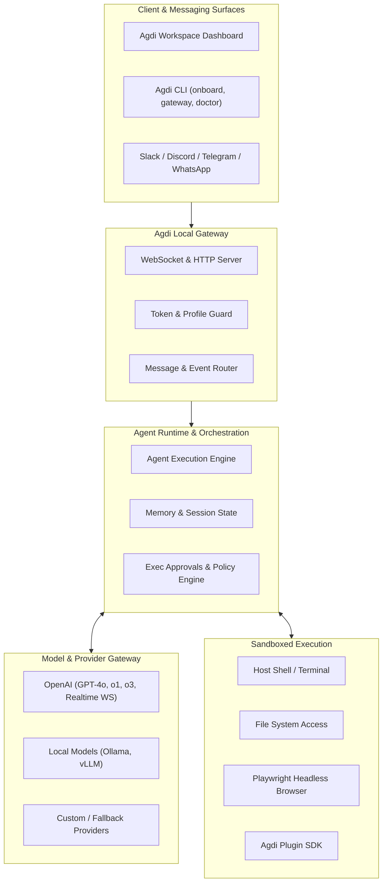

<div align="center">

# Agdi

**A local-first AI agent runtime for autonomous assistants, gateway automations, chat integrations, and secure tool execution.**

[](https://www.npmjs.com/package/agdi)
[](https://www.npmjs.com/package/agdi)
[](LICENSE)
[](https://nodejs.org)
[](CONTRIBUTING.md)

**Published on npm · Local-first architecture**

</div>

---

Agdi gives you a private agent workspace that runs on your own machine or dedicated host. It combines a high-performance local runtime, gateway APIs, chat app connectors, plugin tooling, and an interactive workspace UI so autonomous assistants can execute real work—manipulating files, triggering shell scripts, browsing the web, and synchronizing state—instead of merely generating text.

Agdi is the runtime layer of this repository for developers, platform engineers, and AI automation teams who need fine-grained control over LLM execution, persistent tool safety, and multi-agent coordination.

## Upstream and provenance

Agdi is independently maintained. The gateway, channel connectors, plugin layout, and most of the runtime are derived substantially from [OpenClaw](https://github.com/openclaw/openclaw).

Changes visible in this repository include the `agdi` command and package name, state-directory branding aimed at `~/.agdi`, and additional scan, goals, learning, founder-ops, and MCP command surfaces. Repository metadata points at this GitHub repository.

Compatibility naming that remains includes the `openclaw` executable, `openclaw.plugin.json` manifests, inherited `OPENCLAW_*` environment names, and the `clawdbot` and `moltbot` shims.

Attribution and the evidence table:

- [Third-party notices](THIRD_PARTY_NOTICES.md)
- [Provenance](docs/reference/provenance.md)

---

## 🏗️ Architecture



---

## 🚀 Quick Start

### Installation via npm

```bash
npm install -g agdi
agdi onboard
```

### Pre-Built Binaries

There are no pre-built binaries yet. No tagged release exists, so no standalone
artifacts have been published for any platform. Install from source or from the
npm package until the first release ships.

This section previously listed `agdi-windows.exe`, `agdi-macos`, and
`agdi-linux` as available. None of those artifacts exists, and the claim has been
removed rather than left unverifiable.

### Running the Gateway

Start the local runtime:

```bash
agdi gateway
```

Open the interactive workspace UI:

```bash
agdi dashboard
```

Verify your environment readiness:

```bash
agdi doctor
```

---

## 🤖 OpenAI & Model Provider Integration

Agdi provides deep, first-class support for OpenAI models, including high-reasoning models (`o1`, `o3`), streaming tool-calling, and WebSocket connections:

```bash
# Configure your OpenAI API key
export OPENAI_API_KEY="sk-..."

# Run gateway with OpenAI as primary provider
agdi gateway --provider openai --model gpt-4o
```

### Native Capabilities

- **Structured Tool Execution:** Native function calling and schema validation for agent tool loops.
- **WebSocket Streaming:** Low-latency bidirectional execution telemetry via `openai-ws-stream`.
- **Reasoning Profiles:** Deep planning loops tailored for `o1` and `o3` reasoning workflows.
- **Embeddings & Memory:** Local vector caching powered by OpenAI text embeddings.

---

## 🧩 Core Capabilities

| Capability          | Description                                                                                                       |
| ------------------- | ----------------------------------------------------------------------------------------------------------------- |
| **Local Runtime**   | Full local control over configuration, environment profiles, tools, and execution boundaries.                     |
| **Gateway APIs**    | Bidirectional WebSocket and HTTP interfaces for real-time telemetry, remote control, and automation triggers.     |
| **Workspace UI**    | Live web dashboard for monitoring agent decisions, inspecting token usage, and reviewing tool actions.            |
| **Chat Connectors** | Ready-to-use bridges for Slack, Discord, Telegram, WhatsApp, Matrix, and custom webhooks.                         |
| **Tool Execution**  | Granular, permissioned access to shell commands, filesystem operations, headless web browsing, and external APIs. |
| **Plugin SDK**      | Reusable TypeScript/JavaScript SDK to build custom tools, providers, and channel adapters.                        |
| **Self-Hosting**    | Zero vendor lock-in. Runs cleanly on local machines, WSL, Docker, Linux servers, and macOS hosts.                 |

---

## ⚙️ CLI Reference

| Command          | Purpose                                                                   |
| ---------------- | ------------------------------------------------------------------------- |
| `agdi onboard`   | Interactive setup wizard for runtime configuration and API provider keys. |
| `agdi gateway`   | Launch, inspect, and manage the local gateway daemon.                     |
| `agdi dashboard` | Launch the local web workspace dashboard.                                 |
| `agdi doctor`    | Run comprehensive health and dependency diagnostics.                      |
| `agdi config`    | Inspect, validate, and update runtime settings.                           |
| `openclaw`       | Backward-compatibility command for legacy runtime workflows.              |

---

## 🛡️ Security & Sandbox Model

Agdi operates under an operator-controlled security model:

- **Loopback Default:** Gateway binds to loopback (`127.0.0.1`) by default.
- **Token Protection:** Remote access requires token or password authentication (`AGDI_GATEWAY_TOKEN`).
- **Execution Approvals:** Destructive tools and terminal executions can be gated with interactive confirmation.
- **Vulnerability Reporting:** See [SECURITY.md](SECURITY.md) for disclosure guidelines and security boundaries.

---

## 🤝 Contributing

We welcome community contributions! Please review our [Contributing Guide](CONTRIBUTING.md) and [Code of Conduct](CODE_OF_CONDUCT.md) before opening a pull request or submitting an issue.

```bash
# Clone the repository
git clone https://github.com/anassagd432/Agdi.git
cd Agdi

# Install dependencies and build
pnpm install
pnpm build

# Run test suite
pnpm test
```

---

## 📄 License

This project is licensed under the **MIT License** — see the [LICENSE](LICENSE) file for details.
