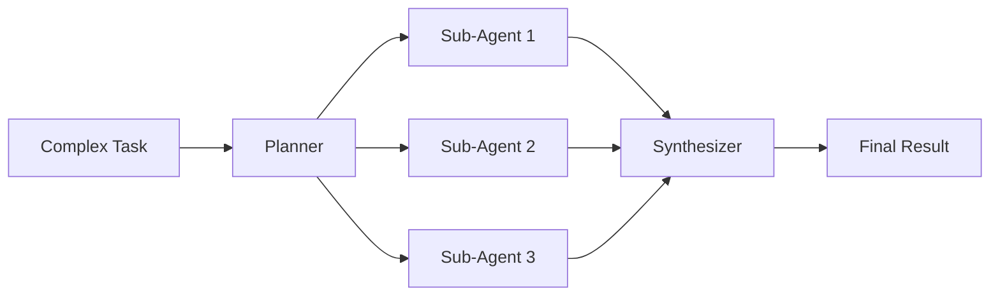

# AI-to-AI Delegation

When AGDI receives a complex directive with multiple parts, it automatically splits the work across parallel sub-agents, coordinates execution, and synthesizes the result.

## How It Works



1. **Task Analysis** — The planner decomposes the task into independent sub-tasks
2. **Agent Spawning** — Each sub-task gets its own agent with isolated context
3. **Parallel Execution** — All sub-agents run concurrently
4. **Result Synthesis** — Outputs are merged into a single coherent result

## Usage

```typescript
import { AIDelegation } from "agdi/autonomous";

const delegation = new AIDelegation();

// Delegate a complex task
const result = await delegation.delegate(
  "Research the top 5 JavaScript frameworks, compare their performance, AND create a summary table"
);

console.log(result.subtasks);    // Individual results
console.log(result.synthesized); // Merged final output
console.log(result.durationMs);  // Total execution time
```

## Examples

**Multi-part research:**
> "Find the cheapest flights to Tokyo AND the best hotels near Shibuya AND top-rated restaurants"

**Parallel automation:**
> "Backup my documents to S3 AND update the database schema AND send the weekly report"

**Combined analysis:**
> "Scan the network for open ports AND check the web app for vulnerabilities AND audit the SSL configuration"
