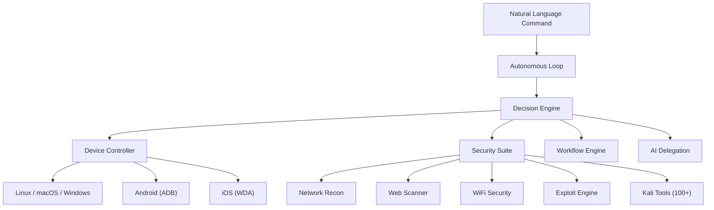

# Autonomous Agent

AGDI ships with a full autonomous agent framework that gives AI direct control over physical devices, security tools, and workflows — no APIs or browser extensions required.

## Architecture



## Core Modules

<Columns>
  <Card title="Device Control" href="/autonomous/device-control" icon="monitor">
    Native mouse, keyboard, and screen control across 5 platforms.
  </Card>
  <Card title="Security Suite" href="/autonomous/security" icon="shield">
    Network recon, web scanning, WiFi attacks, exploit engine, and 100+ Kali tools.
  </Card>
  <Card title="Workflow Automation" href="/autonomous/workflows" icon="repeat">
    Record, replay, and schedule complex multi-step workflows.
  </Card>
  <Card title="AI-to-AI Delegation" href="/autonomous/delegation" icon="users">
    Spawn parallel sub-agents to divide and conquer complex tasks.
  </Card>
</Columns>

## Quick Start

```bash
# Start the autonomous agent
agdi agent --start

# Give it a command
agdi agent --command "Open Firefox and take a screenshot"

# Start the REST API for remote control
agdi agent --rest-api --port 7778
```

## Features at a Glance

| Feature | Description |
|---------|-------------|
| **Native Device Control** | Mouse, keyboard, screen capture via OS-level APIs |
| **5-Platform Support** | Linux (X11), macOS (osascript), Windows (P/Invoke), Android (ADB), iOS (WDA) |
| **Screen OCR** | Read text from the screen with Tesseract — zero API costs |
| **Natural Language Commands** | Plain English → device actions without LLM overhead |
| **Security Suite** | Full offensive security toolkit with 100+ Kali tools |
| **Workflow Record/Replay** | Capture workflows and replay them on demand |
| **Task Scheduler** | Cron-like scheduling for automated tasks |
| **File Watcher** | Trigger actions when files change |
| **Smart Clipboard** | AI-powered clipboard with history and semantic search |
| **AI-to-AI Delegation** | Parallel sub-agents for complex multi-part tasks |
| **REST API** | Control the agent remotely via HTTP |
| **Live Stream** | Real-time screen streaming to the dashboard |
| **Persistent Memory** | Learns your environment and preferences over time |
| **Trust & Safety Gate** | Risk-based action approval system |
